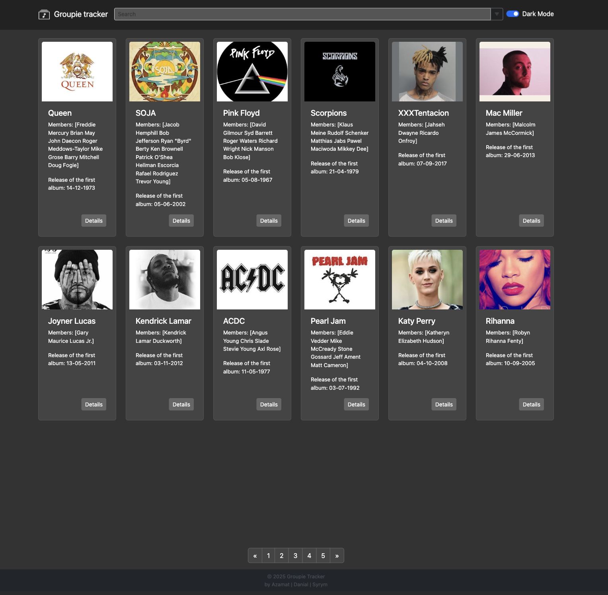
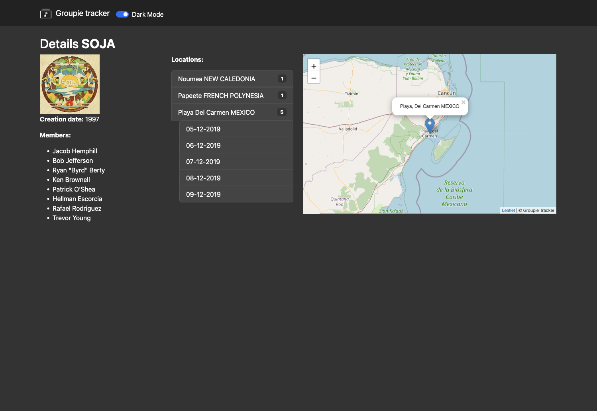

# Groupie Trackers

Groupie Trackers is a web application that fetches data from a given API and displays information about various music bands and artists. The application consists of multiple sections that provide insights into artists, their concert locations, dates, and relations between them.

## Features

- Displays artist details (name, image, active years, first album, members).
- Shows concert locations and dates.
- Implements event-driven interactions between the client and server.
- Ensures proper error handling and stability.
- Uses only standard Go packages.

## Demo




## Installation & Setup

### Prerequisites
- Go installed on your system

### Steps to Run

1. Clone the repository:
   ```sh
   git clone https://github.com/oblist7/groupie-tracker.git
   cd groupie-tracker
   ```
2. Run the backend server:
   ```sh
   go run main.go
   ```
3. Open `http://localhost:8080` in your browser.

## Technologies Used
- Go (backend)
- HTML, CSS, JavaScript, Bootstrap (frontend)
- JSON for data manipulation

## Contribution
Feel free to fork this repository and submit pull requests!

## Author
Syrym Joli